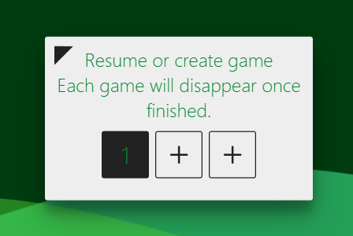

<h1 align=center>SNA Battleships</h1>

 

<h4 align=center>See <a href='https://battleships-p8nf.onrender.com/'>live demo</a></h4>

 

___

 

# Features

- [x] Socket.io server for international play
- [x] Game URL generation
- [x] Replay game feature
- [x] Grid layout playspace
- [x] Main menu animation
- [x] Auto copy share link
- [x] Auto delete finished games after 30 minutes

# TODO

- [ ] Add matchmaking for random public games
- [ ] Add turns spent, hits, and misses overlays

 

___

 

<h2 align=center>Preview:</h2>

 

 

 

 

___

 
<!-- https://checkserp.com/encode/ascii/
&#35;&#32;&#83;&#117;&#112;&#112;&#111;&#114;&#116;&#10;&#10;&#60;&#104;&#51;&#32;&#97;&#108;&#105;&#103;&#110;&#61;&#99;&#101;&#110;&#116;&#101;&#114;&#62;&#83;&#117;&#112;&#112;&#111;&#114;&#116;&#32;&#109;&#101;&#32;&#118;&#105;&#97;&#32;&#80;&#97;&#121;&#80;&#97;&#108;&#58;&#60;&#47;&#104;&#51;&#62;&#10;&#10;&#60;&#98;&#114;&#62;&#10;&#10;&#60;&#97;&#32;&#104;&#114;&#101;&#102;&#61;&#39;&#104;&#116;&#116;&#112;&#115;&#58;&#47;&#47;&#112;&#97;&#121;&#112;&#97;&#108;&#46;&#109;&#101;&#47;&#97;&#105;&#100;&#97;&#110;&#109;&#99;&#103;&#114;&#97;&#119;&#57;&#52;&#51;&#39;&#62;&#10;&#60;&#112;&#32;&#97;&#108;&#105;&#103;&#110;&#61;&#99;&#101;&#110;&#116;&#101;&#114;&#62;&#10;&#60;&#105;&#109;&#103;&#32;&#115;&#114;&#99;&#61;&#39;&#97;&#115;&#115;&#101;&#116;&#115;&#47;&#112;&#97;&#121;&#112;&#97;&#108;&#46;&#112;&#110;&#103;&#39;&#62;&#10;&#60;&#47;&#112;&#62;&#10;&#60;&#47;&#97;&#62;&#10;&#10;&#60;&#98;&#114;&#62;
-->

# Copying

 

<h3 align=center>This project built under the <a href='LICENSE'>MIT License</a></h3>
